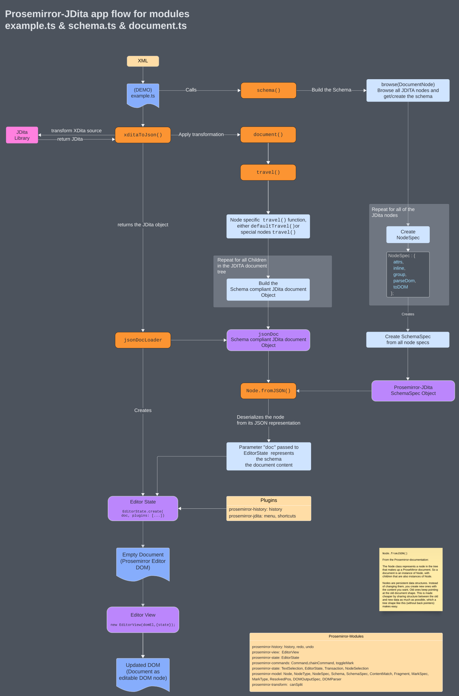

# ProseMirror LwDITA

[](https://nodejs.org)
[](https://www.npmjs.com/package/@evolvedbinary/prosemirror-lwdita)
[](https://circleci.com/gh/evolvedbinary/prosemirror-lwdita)
[](https://coveralls.io/github/evolvedbinary/prosemirror-lwdita?branch=main)

This tool generates ProseMirror documents from JDITA objects. It also provides Schema Definition for proper display and editing of JDITA data.

## Schema

The implemented schema complies with the LwDITA specs v0.3.0.2, see: [https://github.com/oasis-tcs/dita-lwdita/releases/tag/v0.3.0.2](https://github.com/oasis-tcs/dita-lwdita/releases/tag/v0.3.0.2)

## Connecting your documentation page to Petal
Petal offers an way to directly edit your documentation via our API, as show in our [Declarative Amsterdam presentation](https://www.youtube.com/watch?v=Ia5Vb-aA2jk)


Please follow these [instructions](./install-guide-for-documentation-owners.md)
## Usage

Add the library to your project using Yarn or Npm:

```shell
yarn add @evolvedbinary/prosemirror-lwdita
```

```shell
npm install @evolvedbinary/prosemirror-lwdita
```

Include the Library:

```javascript
// SCHEMA builder
import { schema } from "@evolvedbinary/prosemirror-lwdita";
//PLUGINS
import { menu, shortcuts } from "@evolvedbinary/prosemirror-lwdita";
import { document } from "@evolvedbinary/prosemirror-lwdita";
//Transform library
import { xditaToJson } from "lwdita";
```

This is a minimal example of how to use prosemirror-lwdita.
You can check the [included demo](prosemirror-lwdita-demo/src/) for a full example:

```javascript
// Please use a valid XDITA sample,
// e.g. pick one from https://github.com/oasis-tcs/dita-lwdita/tree/spec/org.oasis.xdita/samples/xdita
let xdita = `Insert your XDITA example here`

// Transform the XDITA to JDITA
let jDita = await xditaToJson(xdita,true);
// transform the jdita to Schema compliant Document
let document = await document(jDita);

// create the schema object
const schemaObject = schema();

// build the prosemirror document
const doc = Node.fromJSON(schemaObject, jsonDoc);

// create a new prosemirror state check https://prosemirror.net/docs/ref/#state for more info
const state = EditorState.create({
  doc,
  plugins: [
    shortcuts(schemaObject),
    menu(schemaObject, {}),
  ]
})

//Grab the HTML Dom element to render the editor in
const domEl = document.querySelector("#editor");

// create a new EditorView
new EditorView(domEl, {
  state,
});
```

## Demo

We provide a [small demo](prosemirror-lwdita-demo/src/) to showcase features and as a playground to test all of the features.

```shell
# clone project and install dependencies
git clone https://github.com/evolvedbinary/prosemirror-lwdita.git
cd prosemirror-lwdita
yarn install
# build the project libraries
yarn build

# start the demo
yarn start:demo
```

This will start a demo on `http://localhost:1234`.
If this port is already in use, `parcel` will assign a random port that you can see in the terminal logs.

## Development

### Prerequisites

For development, you will need Node.js and a node package manager, like Yarn, to be installed in your environment.

* Minimal Node version: v22.16.0
* Optional: This project uses Yarn as its build system. Although we don't support it, if you prefer, it should also be possible to use npm instead of Yarn. The version of Yarn that we have used is v4.2.2.

### Installation

Clone the prosemirror-lwdita repository:

```shell
git clone https://github.com/evolvedbinary/prosemirror-lwdita.git
```

Change to the prosemirror-lwdita directory:

```shell
cd prosemirror-lwdita
```

Install all packages:

```shell
yarn install
```

### Build

#### Build the Project

```shell
yarn build
```

#### Build the Demo

```shell
yarn build:demo
```

### Generate the TSDoc Documentation

```shell
yarn run generate-docs
```

This will generate a new folder `generated-docs` containing an HTML file with the entire TSDoc prosemirror-lwdita documentation.
Open this file in a browser to navigate through the documentation.

### Test

This project also has tests which are written using the Mocha framework.
To execute the test suite and view the code coverage, run:

```shell
yarn test # run unit tests

yarn coverage # get coverage
```

## Flow Diagram of prosemirror-lwdita


This diagram demonstrates the library and the internal flow:


