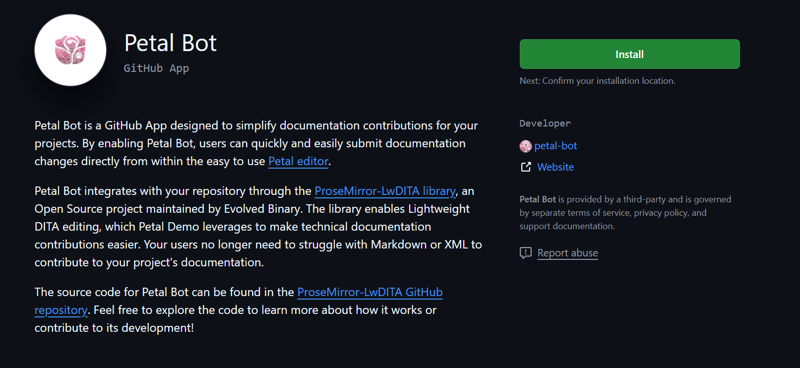
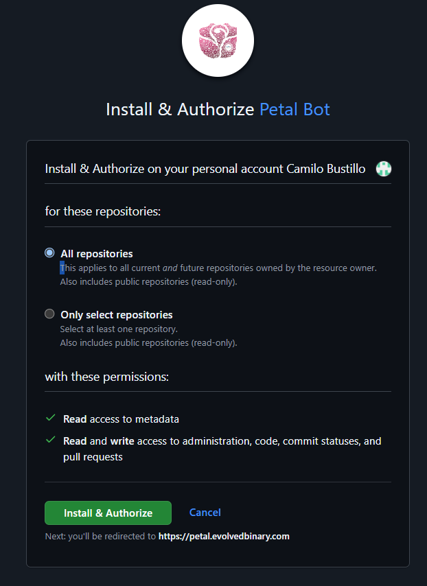

# How to use Petal to simplify your technical documentation workflow
If you are looking to use Petal to simplify your technical documentation workflows, follow these instructions:
## Install Petal-Bot
First you need to install [Petal-bot](https://github.com/apps/petal-bot/) GitHub app that will allow Petal to create PRs on your documentation repository, here's how to do that:
1. Go to https://github.com/apps/petal-bot/
2. Click on the install button 
3. (Optional) Select your documentation repository, by clicking on "Only select repositories
" then select your repository from the drop down
4. Click on "Install & Authorize" 
5. You will be redirected to https://petal.evolvedbinary.com/ once the install is successful

##  Redirect your users to Petal
To let users suggest edits, add a link "Edit This Page" to Petal on each documentation page.

### Why This Is Needed:
This link tells Petal which document to edit, where it’s stored, and which branch to update.

### How to Add the Link:
Add the following code to your documentation page:
```html
<a href="https://petal.evolvedbinary.com?ghrepo=your-org/your-repo
    &source=path-to-your-document.dita
    &branch=main
    &referer=https://your-docs.com/path-to-your-page.html">
  <button>Edit this page...</button>
</a>
```
Replace these placeholders:
1. `your-org/your-repo`: Your GitHub repository name (e.g., "my-org/my-repo").
2. `path-to-your-document.dita`: The file location in your repository (e.g., "docs/my-doc.dita").
3. `main`: The branch where the file exists (e.g., "main").
4. `https://your-docs.com/path-to-your-page.html`: The URL of the documentation page.

## Need More Help?
Watch our talk at Declarative Amsterdam: https://www.youtube.com/watch?v=Ia5Vb-aA2jk

Contact us at petal@evolvedbinary.com